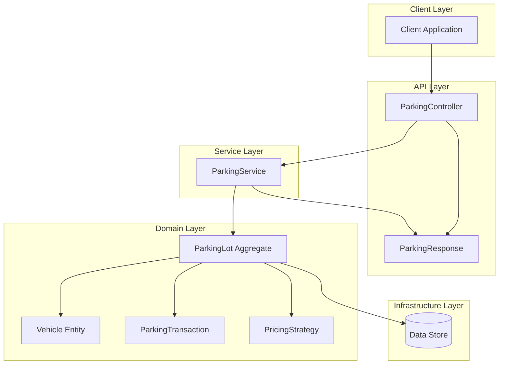
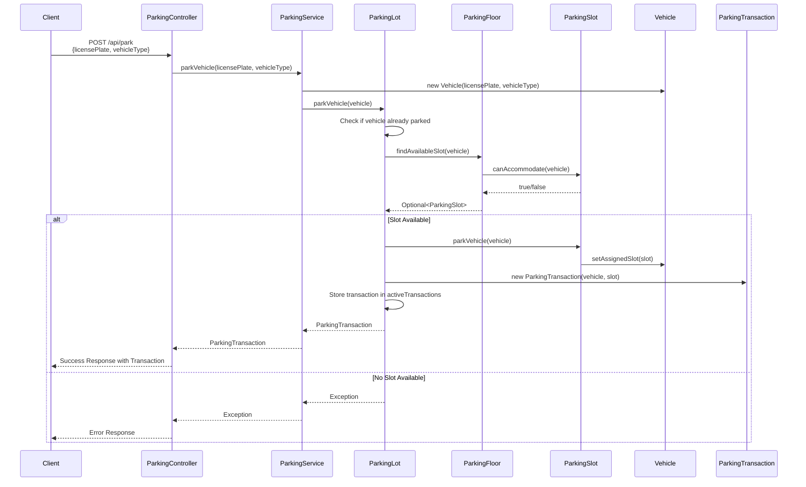
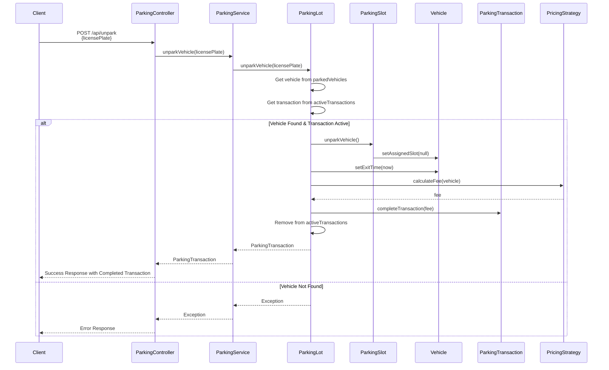
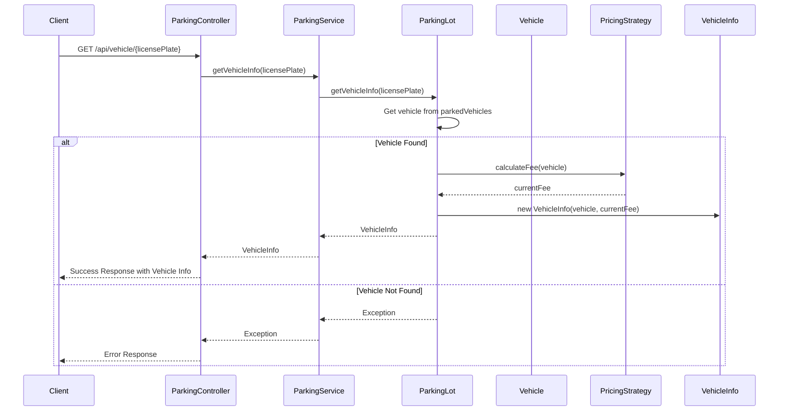
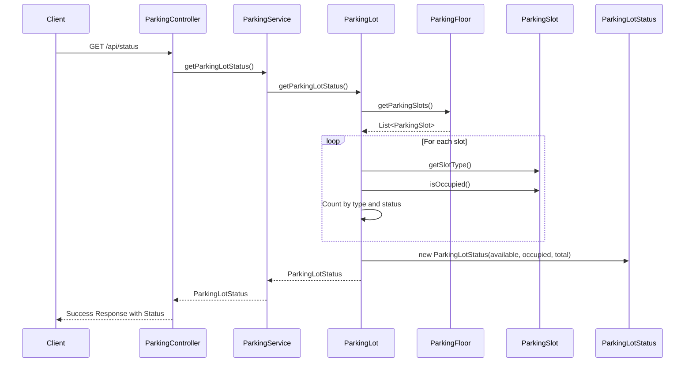
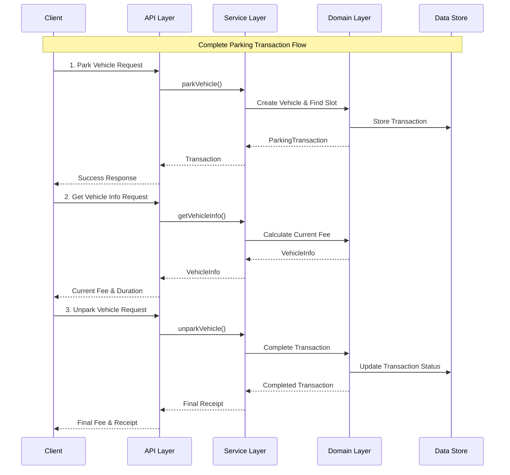
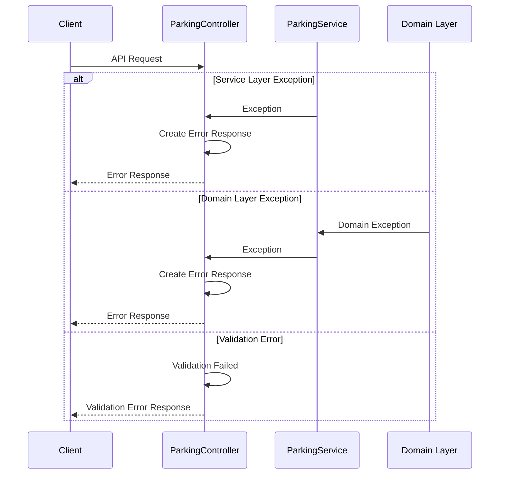
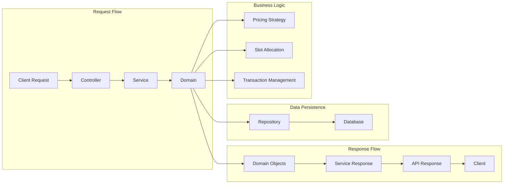

# Parking Lot Management System - API Flow Diagram

## 1. System Architecture Overview



## 2. API 1: Park Vehicle Flow



## 3. API 2: Unpark Vehicle Flow



## 4. API 3: Get Vehicle Info Flow



## 5. API 4: Get Parking Lot Status Flow



## 6. Complete End-to-End Flow Example



## 7. Error Handling Flow



## 8. Data Flow Architecture



## 9. API Response Structure

### Success Response
```json
{
  "success": true,
  "message": "Operation completed successfully",
  "data": {
    "transactionId": "TXN-1234567890",
    "vehicle": {
      "licensePlate": "KA-01-HH-1234",
      "type": "CAR"
    },
    "slot": {
      "slotId": "F1-C5",
      "floorNumber": 1
    },
    "entryTime": "2024-01-15T10:30:00",
    "exitTime": "2024-01-15T12:30:00",
    "fee": 4.0,
    "status": "COMPLETED"
  }
}
```

### Error Response
```json
{
  "success": false,
  "message": "Vehicle KA-01-HH-1234 is not parked",
  "data": null
}
```

## 10. Key Design Patterns Used

1. **Layered Architecture**: Clear separation between API, Service, and Domain layers
2. **Domain-Driven Design**: Rich domain models with business logic
3. **Strategy Pattern**: PricingStrategy for different pricing algorithms
4. **Aggregate Pattern**: ParkingLot as the aggregate root
5. **Value Objects**: ParkingTransaction, VehicleInfo, ParkingLotStatus
6. **Repository Pattern**: Service layer abstracts data access

## 11. Performance Considerations

- **Slot Allocation**: O(n) where n is total number of slots
- **Vehicle Lookup**: O(1) using HashMap for parked vehicles
- **Transaction Management**: O(1) for active transaction lookup
- **Status Calculation**: O(n) for slot iteration (can be optimized with counters)

This API flow diagram provides a comprehensive view of how requests flow through the system, from the client through all layers to the domain and back, ensuring proper separation of concerns and maintainable code structure. 